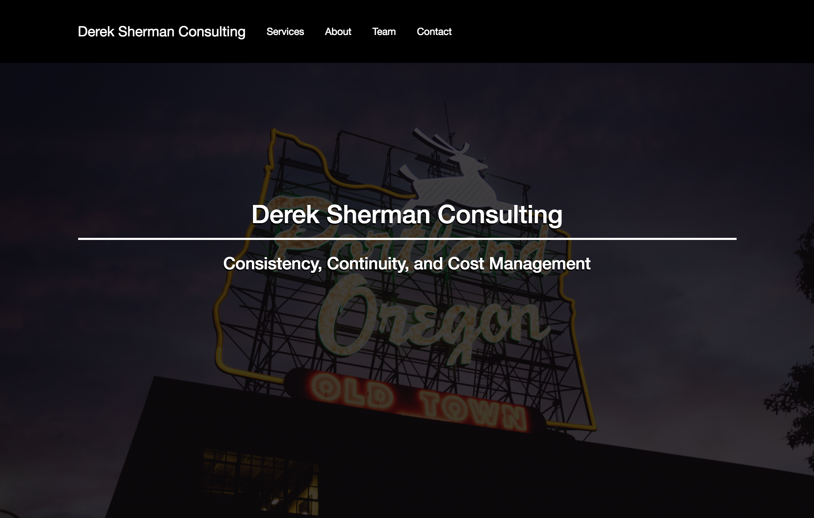

# Project Name
Derek Sherman Consulting Website

## Features
This site will serve as the landing page for Derek Sherman Consulting.

##Languages
CSS, Bootstrap, and JS.

## Usage
To view the site, you can go to: https://mehequanna.github.io/website_for_derek.

To view the code, you can clone the repository at [https://github.com/Mehequanna/website_for_derek](https://github.com/Mehequanna/website_for_derek).

## Author
Stephen Emery

## Resources
Photos by UnSplash, Scrolling Navigation by StartBootstrap, and icons by FontAwesome.

##License
This work can be used under the The MIT License.
Copyright (c) 2016 Stephen Emery
